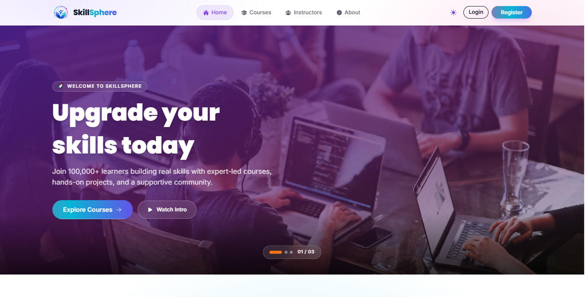
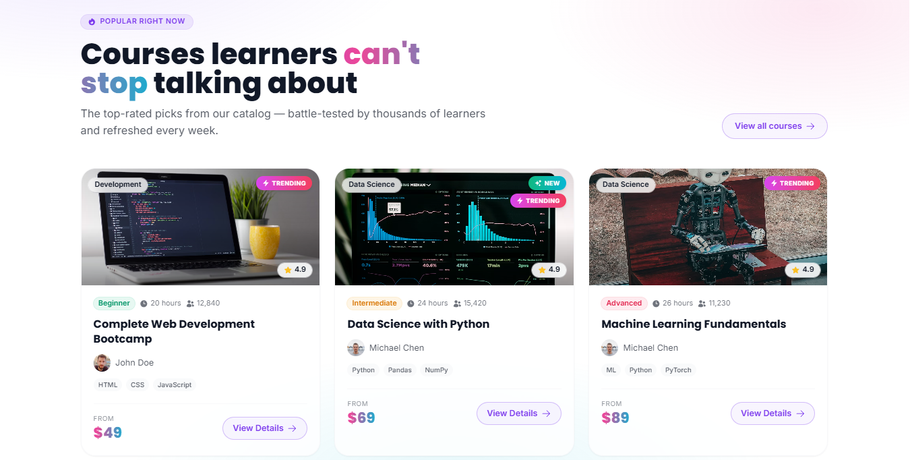
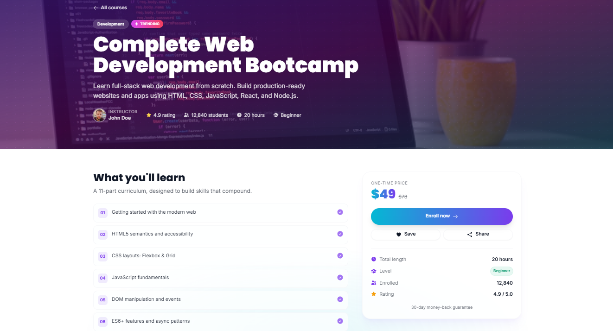

<div align="center">

# SkillSphere

### Modern Learning Management Platform

A polished Next.js LMS-style course platform where learners can browse curated skill-building courses, filter by category and level, view protected course detail pages, sign up with email or Google, manage their profile, and explore instructors, learning tips, and trending programs inside a premium responsive UI.

[](https://skill-sphere-lms.vercel.app/)
[](https://nextjs.org/)
[](https://react.dev/)
[](https://tailwindcss.com/)
[](https://www.better-auth.com/)
[](https://skill-sphere-lms.vercel.app/)

</div>

---

## Preview

<p align="center">
  
</p>

<p align="center">
  
</p>

<p align="center">
  
</p>

> **Live Site:** [https://skill-sphere-lms.vercel.app/](https://skill-sphere-lms.vercel.app/)

---

## Features

| Feature                      | Description                                                                                                |
| :--------------------------- | :--------------------------------------------------------------------------------------------------------- |
| **Course Catalog**           | Browse 8 curated courses with pricing, ratings, instructors, categories, levels, tags, and student counts  |
| **Dynamic Homepage**         | Hero slider, popular courses, trending carousel, learning tips, instructor highlights, and CTA section     |
| **Course Search & Filters**  | Search by title and narrow courses by category or level with instant client-side filtering                 |
| **Protected Course Details** | Course detail pages require authentication and redirect guests back after login                            |
| **Detailed Curriculum View** | Each course includes hero metadata, instructor info, curriculum checklist, skill tags, and enrollment card |
| **Better Auth Login**        | Email/password registration and sign-in powered by Better Auth                                             |
| **Google Social Login**      | One-click Google OAuth sign-in and sign-up support                                                         |
| **Profile Management**       | Protected profile page with account details, stats, sign-out, and editable name/photo URL                  |
| **Session-Aware Navbar**     | Responsive navbar with auth-aware actions, user dropdown, mobile menu, and theme toggle                    |
| **Light/Dark Theme**         | Custom DaisyUI `skillsphere` and `skillsphereDark` themes with localStorage persistence                    |
| **Professional UI Motion**   | Framer Motion page reveals, hover states, animated gradients, and Swiper-powered carousels                 |
| **Legal Pages**              | Privacy Policy and Terms pages built with readable prose styling                                           |
| **Responsive Design**        | Mobile-first layouts for homepage, catalog, auth screens, profile pages, navbar, and footer                |
| **Vercel Ready**             | Built with the Next.js App Router and prepared for production deployment on Vercel                         |

---

## Tech Stack

<div align="center">

|     Technology      | Purpose                                                              |
| :-----------------: | :------------------------------------------------------------------- |
|   **Next.js 15**    | App Router, routing, server rendering, metadata, and deployment      |
|    **React 19**     | Component-driven user interface                                      |
| **Tailwind CSS 3**  | Utility-first styling and responsive layouts                         |
|    **DaisyUI 4**    | Theme tokens, component classes, light/dark theme support            |
|   **Better Auth**   | Authentication, sessions, sign-up, sign-in, and OAuth                |
|    **MongoDB 6**    | Production authentication database storage                           |
| **MongoDB Adapter** | Better Auth database adapter                                         |
|  **Framer Motion**  | Page transitions, reveal animations, and micro-interactions          |
|     **Swiper**      | Hero slider and trending course carousel                             |
|   **React Icons**   | Consistent icon system across navigation, cards, profile, and footer |
| **React Hot Toast** | Toast notifications for auth, enrollment, profile, and UI feedback   |
|     **Vercel**      | Production deployment                                                |

</div>

---

## Project Structure

```text
SkillSphere/
├── public/
│   ├── logo.png
│   ├── preview1.png
│   ├── preview2.png
│   └── preview3.png
├── src/
│   ├── app/
│   │   ├── api/
│   │   │   └── auth/
│   │   │       ├── [...all]/route.js
│   │   │       └── route.js
│   │   ├── courses/
│   │   │   ├── [id]/page.jsx
│   │   │   └── page.jsx
│   │   ├── login/page.jsx
│   │   ├── my-profile/
│   │   │   ├── page.jsx
│   │   │   └── update/page.jsx
│   │   ├── privacy/page.jsx
│   │   ├── register/page.jsx
│   │   ├── terms/page.jsx
│   │   ├── error.jsx
│   │   ├── globals.css
│   │   ├── layout.jsx
│   │   ├── loading.jsx
│   │   ├── not-found.jsx
│   │   └── page.jsx
│   ├── components/
│   │   ├── AuthShell.jsx
│   │   ├── CourseCard.jsx
│   │   ├── CtaBand.jsx
│   │   ├── Footer.jsx
│   │   ├── GoogleButton.jsx
│   │   ├── HeroSlider.jsx
│   │   ├── LearningTips.jsx
│   │   ├── Loader.jsx
│   │   ├── Navbar.jsx
│   │   ├── PopularCourses.jsx
│   │   ├── ThemeScript.jsx
│   │   ├── ToasterProvider.jsx
│   │   ├── TopInstructors.jsx
│   │   └── TrendingCourses.jsx
│   ├── data/
│   │   └── courses.js
│   └── lib/
│       ├── auth-client.js
│       ├── auth.js
│       └── mongo.js
├── eslint.config.mjs
├── jsconfig.json
├── next.config.mjs
├── package.json
├── postcss.config.mjs
├── tailwind.config.js
└── README.md
```

---

## Design Highlights

- **Full-bleed hero slider** with Unsplash course imagery, gradient overlays, autoplay, and slide pagination
- **Premium course cards** with cover images, category pills, level badges, rating chips, instructor avatars, tags, and animated hover states
- **Course catalog workspace** with search input, category chips, level filters, active-filter count, and empty-state recovery
- **Protected course detail layout** with cinematic hero, curriculum checklist, skill tags, sticky pricing card, save/share actions, and enrollment feedback
- **Instructor showcase** with avatar glow effects, expertise badges, ratings, student counts, and course counts
- **Learning playbook section** with numbered habit cards, icon tiles, and responsive two-column composition
- **Profile dashboard** with animated banner, avatar handling, account details, stats, edit profile, and sign-out controls
- **Theme-aware navbar and footer** with logo branding, auth state, mobile menu, newsletter form, contact details, and social links
- **Custom SkillSphere theme system** with violet, fuchsia, cyan, emerald, amber, and rose accents across light and dark modes

---

## API Overview

### Internal API

Authentication is handled by Better Auth and mounted under:

```text
/api/auth
/api/auth/[...all]
```

| Endpoint                   | Method                      | Purpose                                                                       |
| :------------------------- | :-------------------------- | :---------------------------------------------------------------------------- |
| `/api/auth`                | `GET/POST/PATCH/PUT/DELETE` | Better Auth handler for auth operations                                       |
| `/api/auth/[...all]`       | `GET/POST/PATCH/PUT/DELETE` | Catch-all Better Auth route for sessions, email auth, user updates, and OAuth |
| `/api/auth/get-session`    | `GET`                       | Fetch the current user session                                                |
| `/api/auth/sign-up/email`  | `POST`                      | Create an account with email and password                                     |
| `/api/auth/sign-in/email`  | `POST`                      | Sign in with email and password                                               |
| `/api/auth/sign-in/social` | `POST`                      | Start Google OAuth sign-in flow                                               |
| `/api/auth/update-user`    | `POST/PATCH`                | Update profile fields through Better Auth                                     |

### Course Data

Course, instructor, and learning-tip data is loaded from a static JavaScript module:

```text
src/data/courses.js
```

| Export                 | Purpose                                                                                                                  |
| :--------------------- | :----------------------------------------------------------------------------------------------------------------------- |
| `courses`              | 8 course records with title, instructor, duration, rating, students, level, price, image, category, tags, and curriculum |
| `instructors`          | 4 instructor profiles with avatar, title, expertise, bio, student count, course count, and rating                        |
| `learningTips`         | 6 learning habit cards shown on the homepage                                                                             |
| `getPopularCourses()`  | Returns top-rated courses for the homepage                                                                               |
| `getTrendingCourses()` | Returns trending courses for the carousel                                                                                |
| `getCourseById(id)`    | Resolves a single course for protected detail pages                                                                      |
| `getCategories()`      | Builds catalog filter options from course categories                                                                     |

### Client-Side Storage

| Storage Key | Purpose                                            |
| :---------- | :------------------------------------------------- |
| `ss-theme`  | Persists the selected SkillSphere light/dark theme |

---

## Environment Variables

Create a `.env` file in the project root and configure these values:

```env
# Better Auth
BETTER_AUTH_SECRET=your_random_secret
BETTER_AUTH_URL=http://localhost:3000
NEXT_PUBLIC_BETTER_AUTH_URL=http://localhost:3000

# MongoDB
MONGODB_URI=your_mongodb_connection_string
MONGODB_DB_NAME=skillsphere

# Google OAuth
GOOGLE_CLIENT_ID=your_google_oauth_client_id
GOOGLE_CLIENT_SECRET=your_google_oauth_client_secret
```

For production, set:

```env
BETTER_AUTH_URL=https://skill-sphere-lms.vercel.app
NEXT_PUBLIC_BETTER_AUTH_URL=https://skill-sphere-lms.vercel.app
```

---

## Getting Started

Install dependencies:

```bash
npm install
```

Run the development server:

```bash
npm run dev
```

Open the app:

```text
http://localhost:3000
```

Build for production:

```bash
npm run build
```

Run the production server:

```bash
npm start
```

Lint the project:

```bash
npm run lint
```

---

## Deployment

The application is deployed on **Vercel**:

**Live URL:** [https://skill-sphere-lms.vercel.app/](https://skill-sphere-lms.vercel.app/)

---

<div align="center">

**If you found this project useful, consider giving it a star.**

Made using Next.js, React, Tailwind, Better Auth, MongoDB, Framer Motion and Vercel.

</div>
